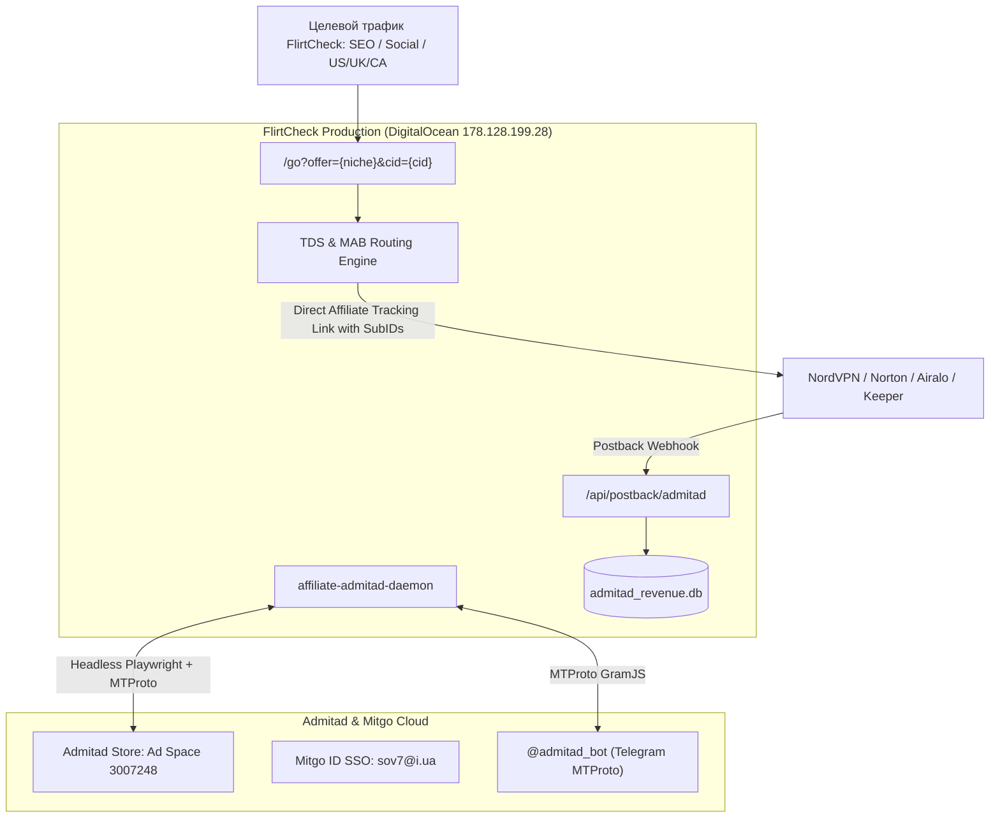

# 01. Архитектура экосистемы Mitgo & Admitad

## 1. Концепция платформы

Партнерская сеть **Admitad Store** входит в холдинг **Mitgo Group**. В рамках проекта FlirtCheck настроена единая связка между веб-кабинетом, Telegram MTProto Bot и боевым бэкендом.

---

## 2. Ключевые учетные сущности

* **Аккаунт Mitgo ID:** `sov7@i.ua`
* **ID площадки (Ad Space ID):** `3007248`
* **Название площадки:** `FlirtCheck - Dating Safety & Verification Lab`
* **Тип площадки:** Веб-сайт (Контентный сайт / Обзоры и расследования)
* **Категории площадки:** Интернет-услуги, Софт, Безопасность, Дейтинг
* **География аудитории:** США (US), Великобритания (UK), Канада (CA), Австралия (AU), Евросоюз (EU).

---

## 3. Точки взаимодействия и протоколы

1. **Headless Browser Interface (Playwright):**
   * Сессия авторизации сохраняется в `artifacts_admitad/auth_state.json`.
   * Автоматический обход Cookie Consent (`#cmpwrapper` / ConsentManager).
   * Доступ ко всем скрытым разделам каталога, подаче заявок, выгрузке баннеров и отчетов.

2. **Telegram MTProto Bot Interface (`@admitad_bot`):**
   * Прямое клиентское соединение по протоколу MTProto через библиотеку `telegram` (GramJS).
   * Авторизованная сессия под профилем `Justin Case` (`@RealJastInCase`, ID: `808343978`).
   * Мгновенная генерация Deeplink-ссылок, получение промокодов (`/get_coupons`), проверка статистики (`/check_stats`).

3. **Postback Webhook Interface:**
   * Эндпоинт: `https://flirtcheck.site/api/postback/admitad`.
   * Передача данных в режиме реального времени: `order_id`, `subid` (ClickID), `payment` (комиссия), `status` (pending/approved), `action_date`.

4. **Admitad Lite:**
   * Каталог из 30 000+ офферов без предварительной модерации для моментальной подстановки ссылок при написании новых статей.
