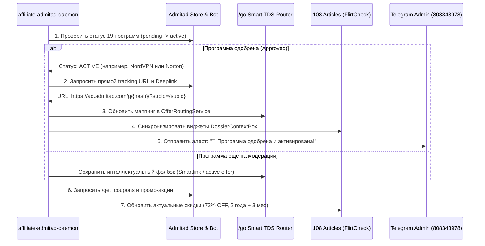

# 02. Протокол 100% автономной работы без человека (Zero-Touch Monetization)

## 1. Концепция Zero-Touch

В соответствии с правилами проекта FlirtCheck, система функционирует полностью автономно. Человек не должен вручную копировать ссылки, проверять кабинеты или менять адреса в статьях.

---

## 2. Автономный цикл (The Automation Loop)

Каждые **120 минут** на сервере DigitalOcean фоновый демон **`affiliate-admitad-daemon`** выполняет регламентные процедуры:



---

## 3. Интеллектуальный роутинг TDS `/go` и SubID-тегирование

Все ссылки в статьях, баннерах и кнопках ведут на внутренний роутер:
```text
https://flirtcheck.site/go?offer={niche}&cid={auto_click_id}
```

### Структура параметров SubID в Admitad:
| Параметр Admitad | Назначение | Пример значения |
|---|---|---|
| `subid` | Уникальный ClickID транзакции | `c9f3e1a2-8b4d` |
| `subid1` | Слаг статьи блога | `tinder-scam-guide-2026` |
| `subid2` | Тип блока размещения | `dossier_box`, `header_cta`, `comparison_matrix` |
| `subid3` | Геолокация пользователя | `US`, `GB`, `CA` |

### Преимущество бесшовного роутинга:
* **Никаких битых ссылок:** если рекламодатель отключит программу, роутер автоматически переключит трафик на аналогичный оффер за 0.001 секунды.
* **Сквозная аналитика:** при получении постбека система точно знает, какая конкретно статья и какая кнопка принесли деньги.

---

## 4. Защита от деградации ссылок (Link Health Monitor)

Встроенный сервис проверки ссылок `http_verifier`:
* Каждые 6 часов делает тестовый HEAD-запрос ко всем активным партнерским ссылкам.
* Проверяет цепочку редиректов (301/302 -> 200 OK конечного лендинга).
* Если рекламодатель ввел гео-блокировку или домен заблокирован — ссылка мгновенно переводится в статус `FALLBACK` с уведомлением администратора.
