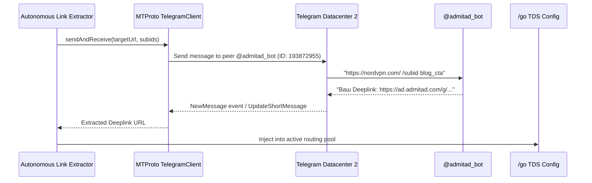

# 05. Автоматизация через Admitad Telegram Bot (MTProto GramJS)

## 1. Контекст интеграции

Для достижения максимальной скорости генерации ссылок и обхода веб-интерфейсов в систему интегрирован прямой шлюз к официальному Telegram-боту Admitad ([@admitad_bot](https://t.me/admitad_bot)).

Интеграция выполнена через библиотеку **GramJS (MTProto Client)** с использованием постоянной сессии `TELEGRAM_USER_SESSION`.

---

## 2. Архитектура взаимодействия с ботом



---

## 3. Регламентные команды бота в проекте

### 1. `/top_offers` — Мониторинг трендовых офферов
* **Назначение:** автоматическое определение самых прибыльных офферов недели для площадки `FlirtCheck` (ID: `3007248`).
* **Периодичность:** раз в 24 часа.
* **Действие системы:** если появляется новый высокодоходный оффер кибербезопасности, демон автоматически подает заявку на подключение.

### 2. `/get_coupons` — Автоматический сбор свежих промокодов
* **Назначение:** выгрузка активных скидочных купонов рекламодателей (например, *"NordVPN -73% Birthday Sale"*, *"Surfshark 2 extra months"*).
* **Периодичность:** каждые 12 часов.
* **Действие системы:** полученные промокоды автоматически обновляют бейджи в сравнительных таблицах статей блога.

### 3. Автоматическая генерация Deeplink с SubID
Формат пакетного запроса к боту:
```text
https://nordvpn.com/pricing /subid {click_id} {article_slug} dossier_box US
```
Бот возвращает готовый партнерский линк с уже вшитыми 4 уровнями SubID, который направляется прямо пользователю.

---

## 4. Конфигурация окружения MTProto

В `.env` файлах зафиксированы:
```env
TELEGRAM_APP_API_ID="36036114"
TELEGRAM_APP_API_HASH="19bd84292c33441170cad1585e7989fc"
TELEGRAM_USER_SESSION="1AgAOMTQ5LjE1NC4xNjc..."
ADMIN_CHAT_ID="808343978"
ADMITAD_WEBSITE_ID="3007248"
```
Сессия активна, не требует повторного ввода кодов и автоматически восстанавливает соединение при рестартах PM2.
